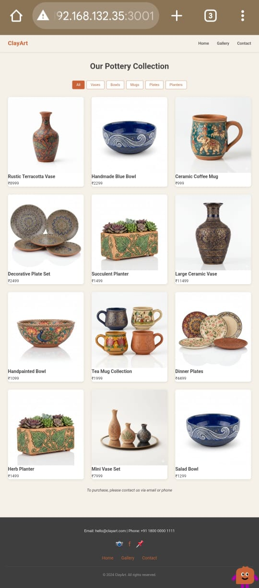
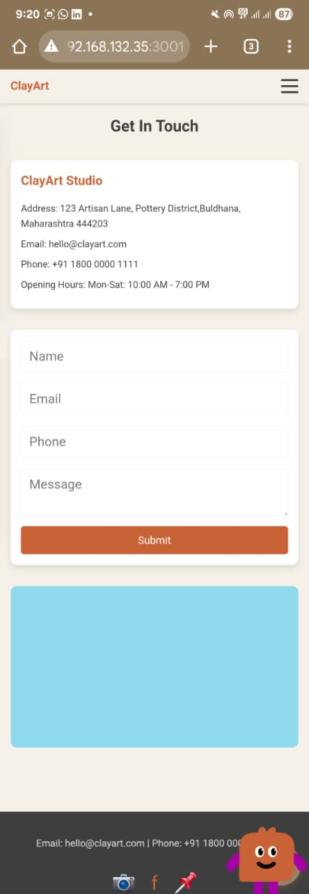
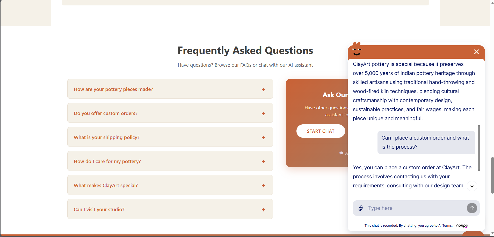

# TOPIC E-Commerce Website /  Retail Business

# ClayArt - Handmade Pottery & Ceramics Gallery  

## 📌 Project Overview

ClayArt is a beautiful online pottery gallery and e-commerce platform that celebrates traditional Indian pottery craftsmanship. The website showcases handmade ceramic pieces created by skilled artisans using century-old techniques blended with modern design.

**Main Goal:** To preserve and promote Indian pottery heritage while supporting local artisans and making traditional pottery accessible to customers worldwide.

---

## 🎯 Project Idea

ClayArt bridges the gap between traditional pottery makers and modern customers. Instead of mass-produced ceramics, customers can buy authentic, handcrafted pottery pieces that:
- Support skilled artisans directly
- Preserve 5,000+ years of Indian pottery tradition
- Offer unique, one-of-a-kind products
- Follow eco-friendly sustainable practices

---

## ✨ Key Features

### 1. **Home Page**
- Attractive hero section with call-to-action
- Featured pottery collection showcase
- "Our Story" section explaining company heritage
- Team member profiles
- FAQ section with dropdown answers
- Call-to-action section

### 2. **Gallery Page**
- Display all 12 pottery products
- Filter by category (Vases, Bowls, Mugs, Plates, Planters)
- Click products to view details in a modal
- Responsive grid layout

### 3. **Contact Page**
- Contact form with validation
- Shop information
- Google Maps embed for location
- Email, phone, and address details

### 4. **AI Chatbot**
- Noupe chatbot integration
- Available 24/7 to answer customer questions
- Trained on ClayArt product information
- Floating chat button on all pages

### 5. **Responsive Design**
- Works perfectly on desktop, tablet, and mobile
- Mobile hamburger menu
- Touch-friendly buttons and forms
- Adaptive layouts

### 6. **Product Features**
- 12 handmade pottery items with real images
- Product prices in Indian Rupees (₹)
- Category-based organization

---

## 🛠️ Technology Stack

| Technology | Purpose |
|-----------|---------|
| **React 18.2.0** | Frontend framework for building user interface |
| **React Router DOM 6.20.0** | Page routing and navigation |
| **CSS3** | Styling and responsive design |
| **JavaScript (ES6+)** | Interactive features and logic |
| **Noupe Chatbot API** | AI-powered customer support chatbot |
| **npm** | Package management |

---


## 🚀 How to Setup & Run Locally

### Prerequisites
- Node.js (version 14 or higher)
- npm (comes with Node.js)
- Git

### Step 1: Clone the Repository
```bash
git clone https://github.com/yourusername/clayart.git
cd clayart
```

### Step 2: Install Dependencies
```bash
npm install
```

### Step 3: Create Environment File
Create a `.env` file in the root directory:
```
REACT_APP_GEMINI_API_KEY=your_api_key_here
```

### Step 4: Run the Development Server
```bash
npm start
```

The website will open automatically at `http://localhost:3000`

### Step 5: Build for Production (Optional)
```bash
npm run build
```

---

## 📁 Project Structure

```
clayart/
│
├── public/
│   ├── index.html          # Main HTML file with chatbot script
│   └── images/             # Product images
│
├── src/
│   ├── components/
│   │   ├── Navbar.js       # Navigation bar with mobile menu
│   │   ├── Navbar.css
│   │   ├── Footer.js       # Footer with contact info
│   │   ├── Footer.css
│   │   ├── ProductCard.js  # Reusable product card component
│   │   └── ProductCard.css
│   │
│   ├── pages/
│   │   ├── Home.js         # Home page with hero, featured, about, FAQ
│   │   ├── Gallery.js      # Gallery with products and filters
│   │   └── Contact.js      # Contact form and shop info
│   │
│   ├── styles/
│   │   ├── Home.css        # Home page styling
│   │   ├── Gallery.css     # Gallery styling
│   │   ├── Contact.css     # Contact form styling
│   │   └── ChatWidget.css  # Chatbot styling
│   │
│   ├── data/
│   │   └── products.js     # Array of 12 pottery products
│   │
│   ├── App.js              # Main app component with routing
│   ├── App.css             # Global styles
│   └── index.js            # React entry point
│
├── package.json            # Project dependencies
├── .env                    # Environment variables
└── README.md               # This file
```

---

## 🎨 Pages Overview

### Home Page (`/`)
- Hero banner
- Featured products (first 6)
- Company story section
- Team member cards
- FAQ with dropdown answers
- AI chatbot widget
- Final CTA section

### Gallery Page (`/gallery`)
- All 12 products in grid
- Category filters
- Product details modal
- Responsive layout

### Contact Page (`/contact`)
- Contact form with validation
- Shop information
- Google Maps location

---

## 📸 Website Screenshots

### Home Page


### About Us Section


### Gallery Page


### Contact Page


### AI Chatbot


---


## 📄 Full Documentation

For detailed product information, FAQ answers, and chatbot knowledge base, see [WEBSITE_DOCUMENTATION.txt](./WEBSITE_DOCUMENTATION.txt)

---

## 📧 Contact

For questions or feedback, please create an issue in this GitHub repository.

---

## 🙏 Acknowledgments

- Traditional Indian pottery heritage inspiration
- Noupe chatbot integration
- Modern web design principles

---

**Last Updated:** December 2025

